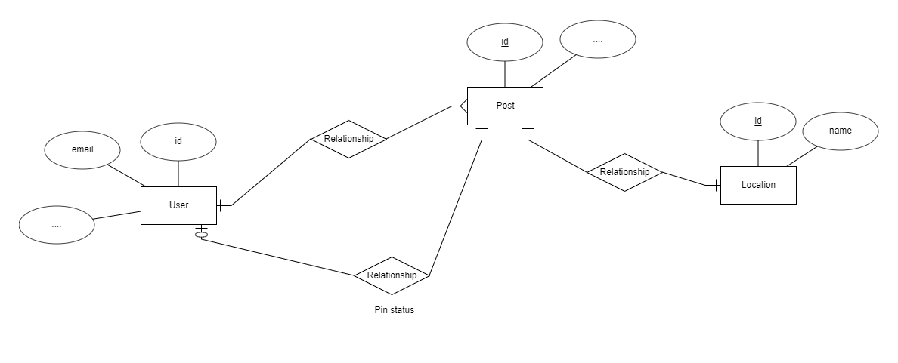
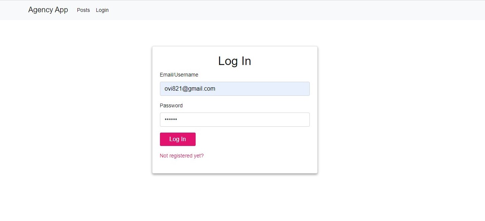
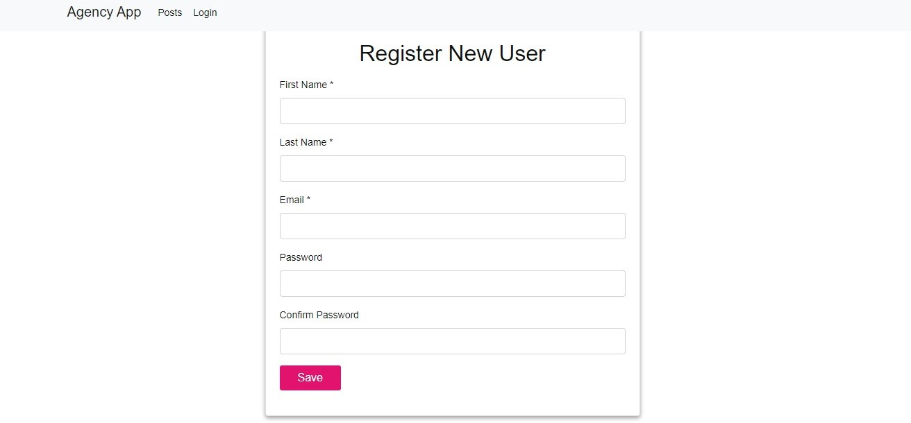
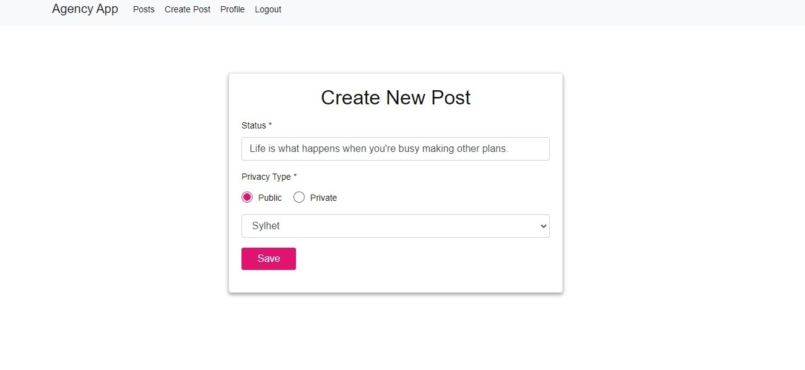
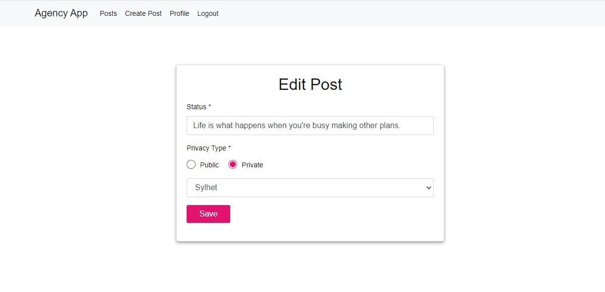
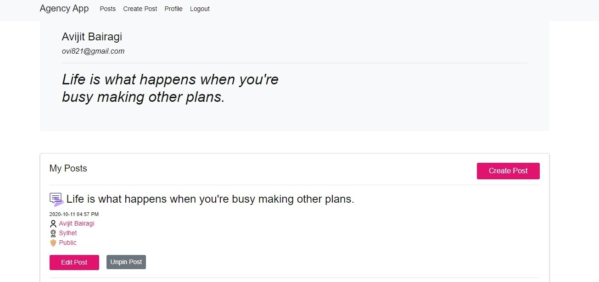
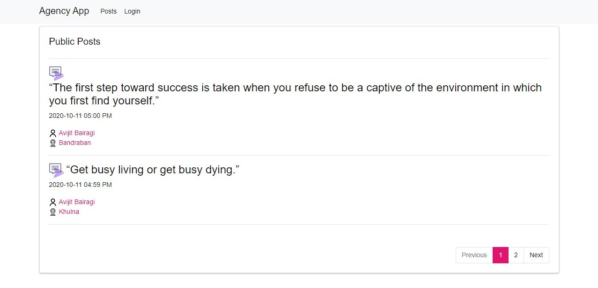

## agency-app
context path: http://YOUR_PORT:8999/agency/  
[DB Script](https://github.com/avijit-bairagi/agency-app/blob/main/db/agency.sql)

## bonus works: 
    - Pagination
    - Unpin post
    - Global error handler
    - Global error page
    
## Environment: 
    - Server: tomcat 
    - JDK: 11
    - MYSQL

# Instructions
    ### Step 1
        - replace db crediential at application.yml file (db port, bd server url/ip, user and password)
        - execute the shared sql script
        - import and run the project
    ### Step 2
        - find the shared war file
        - before deploy the war file run the db script and replace db crediential (db port, bd server port/ip, user and password)

# ER-diagram

 
 
 # UI

 Login
 
 
 Register
 
  
  Create post
 
 
 Edit post
 
  
  Profile
 
 
 Public posts
 
